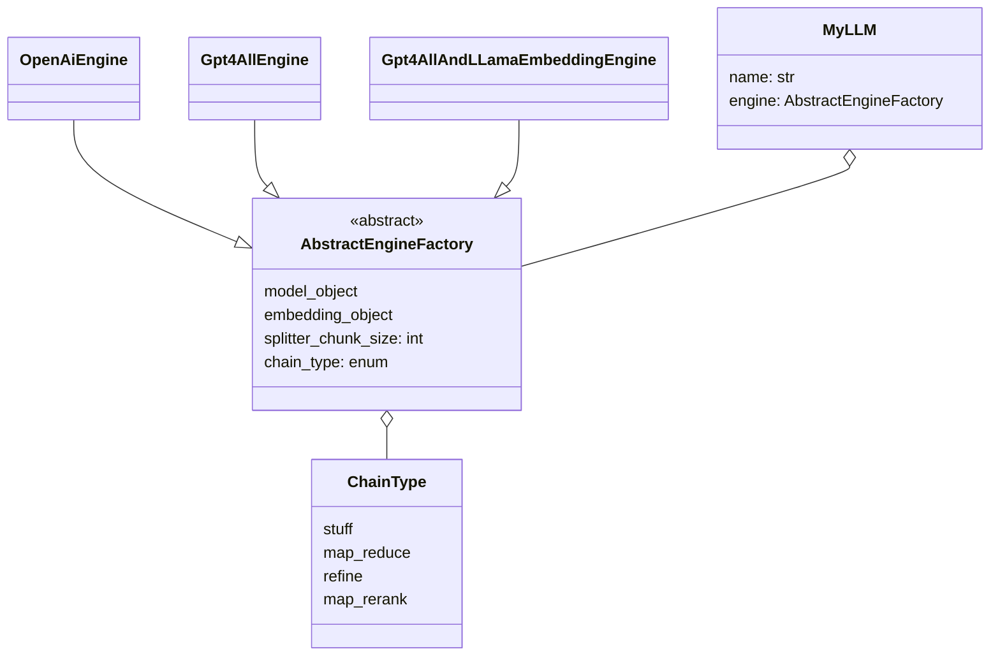

# AmeliaGPT

More details around this project found at 
https://dtools.ipsoft.com/confluence/display/CO/AmeliaGPT

## Installation
- Install Python 3.11 or above

```shell
$ git clone https://dtools.ipsoft.com/bitbucket/scm/~dengvall/ameliagpt.git
$ cd AmeliaGPT && python3 -m pip install -r requirements.txt
$ mkdir docs   (place your docs there)
```
Note this was tested using langchain==0.0.266


- Add API keys
````shell
$ vi .env

OPENAI_API_KEY=xxx
NGROK_AUTHTOKEN=xxx
````

#### Get above API keys at
- https://openai.com/blog/openai-api  - if you wish to use OpenAI
- https://ngrok.com/docs/api/resources/api-keys/  - if you wish to have support for ingress tunnel

#### Give support for GPT4ALL (local LLM)
Also include following steps
```shell
# Based on https://github.com/nomic-ai/gpt4all/tree/main/gpt4all-bindings/python
git clone --recurse-submodules https://github.com/nomic-ai/gpt4all.git
cd gpt4all/gpt4all-backend/
mkdir build
cd build
cmake ..
cmake --build . --parallel  # optionally append: --config Release
# Confirm that libllmodel.* exists in gpt4all-backend/build
cd ../../gpt4all-bindings/python
pip3 install -e .
```

##### Download link to LLM model tested with GPT4All model
https://huggingface.co/mrgaang/aira/blob/main/gpt4all-converted.bin
Place these into `~/.cache/gpt4all/` for convenience.

#### Download link to LLama embedding model used
https://huggingface.co/Pi3141/alpaca-native-7B-ggml/commit/397e872bf4c83f4c642317a5bf65ce84a105786e
Place these into `~/.cache/gpt4all/` for convenience.


## How to use

### Basic arguments

You have the basic commands

- **add-documents** - for adding PDF, DOCS and TXT to be processed and stored to similarity (vector) database
- **count-tokens** - if you wish to do some rough estimates of costs e.g. using OpenAI
- **start** - this starts the service

You need to supply one of the following "engines" to be used

- OpenAiEngine
- Gpt4AllEngine
- Gpt4AllAndLLamaEmbedding


```shell
 Usage: python -m ameliagpt add-documents [OPTIONS] DOCS_PATH ENGINE:{Gpt4A 
                                          llEngine|Gpt4AllAndLLamaEmbedding 
                                          Engine|OpenAiEngine}              
                                                                            
╭─ Arguments ──────────────────────────────────────────────────────────────╮
│ *    docs_path      PATH                      Path to docs to be used    │
│                                               with LLM                   │
│                                               [default: None]            │
│                                               [required]                 │
│ *    engine         ENGINE:{Gpt4AllEngine|Gp  Which LLM engine to use    │
│                     t4AllAndLLamaEmbeddingEn  [default: None]            │
│                     gine|OpenAiEngine}        [required]                 │
╰──────────────────────────────────────────────────────────────────────────╯
╭─ Options ────────────────────────────────────────────────────────────────╮
│ --name        TEXT  Name of database [default: llm]                      │
│ --help              Show this message and exit.                          │
╰──────────────────────────────────────────────────────────────────────────╯

                                                                            
 Usage: python -m ameliagpt count-tokens [OPTIONS] DOCS_PATH                
                                                                            
╭─ Arguments ──────────────────────────────────────────────────────────────╮
│ *    docs_path      PATH  Path to docs to be used with LLM               │
│                           [default: None]                                │
│                           [required]                                     │
╰──────────────────────────────────────────────────────────────────────────╯
╭─ Options ────────────────────────────────────────────────────────────────╮
│ --help          Show this message and exit.                              │
╰──────────────────────────────────────────────────────────────────────────╯

                                                                            
 Usage: python -m ameliagpt start [OPTIONS] [NAME] ENGINE:{Gpt4AllEngine|Gp 
                                  t4AllAndLLamaEmbeddingEngine|OpenAiEngine 
                                  }                                         
                                                                            
╭─ Arguments ──────────────────────────────────────────────────────────────╮
│      name        [NAME]                      Name of database            │
│                                              [default: llm]              │
│ *    engine      ENGINE:{Gpt4AllEngine|Gpt4  Which LLM engine to use     │
│                  AllAndLLamaEmbeddingEngine  [default: None]             │
│                  |OpenAiEngine}              [required]                  │
╰──────────────────────────────────────────────────────────────────────────╯
╭─ Options ────────────────────────────────────────────────────────────────╮
│ --port                                     INTEGER  Server port          │
│                                                     [default: 8000]      │
│ --tunnel-enabled    --no-tunnel-enabled             NGROK tunnel enabled │
│                                                     [default:            │
│                                                     no-tunnel-enabled]   │
│ --help                                              Show this message    │
│                                                     and exit.            │
╰──────────────────────────────────────────────────────────────────────────╯


```

Once started you have services you can access .. 

### Local API docs
http://127.0.0.1:8000/api

### Conversation tester
http://127.0.0.1:8000/conversation/

### Enabling NGROK inbound tunnel

Now in such case you have configure API key for NGROK you are also able to enable the `--tunnel-enabled` argument when starting the service.

## Extend with new engine profiles

All that you need to do is to make subclass of AbstractEngineFactory and you'll have this engine as an option when you embed document or start the service. To get a sense of the classes and its attributes look at the below class diagram.

## Class diagram




## Author

Feel free to contact daniel.engvall@amelia.com 